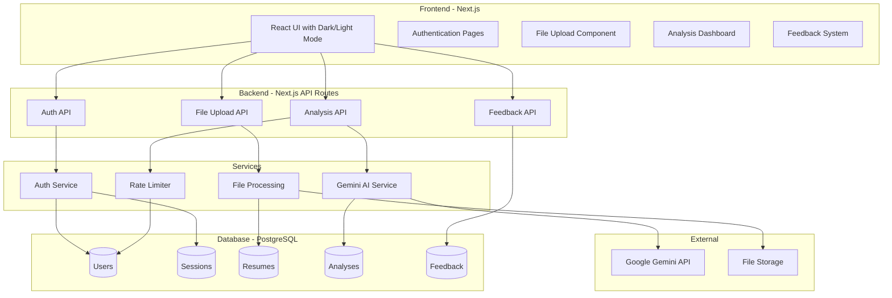

# Resume AI Agent - Implementation Plan

A production-ready resume analysis platform with user authentication, AI-powered insights using Google Gemini, and scalable architecture for 10,000+ users/hour.

## User Review Required

> [!IMPORTANT]
> **Gemini API Key Required**: You'll need to provide a Google Gemini API key for the AI analysis features. Please confirm you have access to this.

> [!IMPORTANT]
> **Database Choice**: This plan uses PostgreSQL for scalability. Confirm if you have PostgreSQL available or prefer a different database (e.g., SQLite for development, cloud PostgreSQL for production).

> [!IMPORTANT]
> **Deployment Target**: Where would you like this deployed? Options include:
> - Vercel (recommended for Next.js)
> - Self-hosted (Docker)
> - Cloud providers (AWS, GCP, Azure)

---

## Architecture Overview



---

## Proposed Changes

### 1. Project Foundation

#### [NEW] package.json
Next.js 14 project with TypeScript, Prisma ORM, authentication libraries, and testing frameworks.

#### [NEW] prisma/schema.prisma
Database schema with models:
- **User**: id, username, email, passwordHash, createdAt, lastLoginAt
- **Session**: id, userId, token, expiresAt
- **Resume**: id, userId, fileName, fileType, filePath, extractedText, createdAt
- **Analysis**: id, userId, resumeId, jobDescription, model, matchPercentage, insights, recommendations, createdAt
- **Feedback**: id, userId, rating, category, message, createdAt
- **QueryUsage**: id, userId, queryTimestamp (for rate limiting)

---

### 2. Backend API Routes

#### [NEW] src/app/api/auth/signup/route.ts
User registration with:
- Username validation (any format allowed)
- Email validation
- Strong password validation (12+ chars, uppercase, lowercase, number, special char)
- Password hashing with bcrypt

#### [NEW] src/app/api/auth/login/route.ts
Login with session token generation.

#### [NEW] src/app/api/auth/logout/route.ts
Session invalidation.

#### [NEW] src/app/api/upload/route.ts
File upload handling:
- Accept PDF, DOCX, PNG, JPG, JPEG, WEBP
- Max 6 images or 1 document
- File size limits (10MB per file)
- Extract text from PDF/Word using pdf-parse and mammoth
- Store files locally or in cloud storage

#### [NEW] src/app/api/analyze/route.ts
AI analysis endpoint:
- Rate limiting (5 queries per 24-hour rolling window)
- Model selection (gemini-1.5-flash, gemini-1.5-pro, gemini-2.0-flash)
- Resume + Job Description analysis
- Return structured insights

#### [NEW] src/app/api/feedback/route.ts
Feedback submission and retrieval.

---

### 3. Services Layer

#### [NEW] src/lib/services/auth.service.ts
Authentication logic with password validation, hashing, session management.

#### [NEW] src/lib/services/file.service.ts
File processing: PDF text extraction, Word document parsing, image handling.

#### [NEW] src/lib/services/ai.service.ts
Gemini integration with structured prompts for:
- Match percentage calculation
- Bottleneck identification
- Missing skills/keywords
- Bullet point improvements
- Resource recommendations

#### [NEW] src/lib/services/ratelimit.service.ts
24-hour rolling window rate limiter.

---

### 4. Frontend Components

#### [NEW] src/app/page.tsx
Landing page with hero section and feature highlights.

#### [NEW] src/app/auth/signup/page.tsx
Signup form with real-time password strength indicator.

#### [NEW] src/app/auth/login/page.tsx
Login form.

#### [NEW] src/app/dashboard/page.tsx
Main dashboard with:
- Resume upload zone
- Job description input
- Model selector
- Analysis results display
- Query usage indicator

#### [NEW] src/components/ThemeProvider.tsx
Dark/Light mode toggle with system preference detection.

#### [NEW] src/components/FileUpload.tsx
Drag-and-drop file upload with preview.

#### [NEW] src/components/AnalysisResults.tsx
Visual display of match percentage, insights, recommendations.

#### [NEW] src/components/FeedbackModal.tsx
Feedback form with rating stars and suggestion input.

---

### 5. Styling

#### [NEW] src/app/globals.css
CSS with:
- CSS variables for theming (dark/light)
- Modern glassmorphism effects
- Smooth transitions and animations
- Responsive design

---

## Verification Plan

### Automated Tests

#### Unit Tests
```bash
# Run all unit tests
npm run test

# Run specific test file
npm run test -- src/__tests__/services/auth.service.test.ts
```

Tests will cover:
- Password validation logic
- Rate limiting calculations
- File type validation
- API response formatting

#### Integration Tests
```bash
# Run integration tests (requires test database)
npm run test:integration
```

Tests will cover:
- Full signup/login flow
- File upload and processing
- Analysis API with mock Gemini responses
- Rate limiting enforcement

### Manual Verification

1. **Authentication Flow**
   - Create account with various username formats
   - Verify password strength requirements
   - Test login/logout functionality

2. **File Upload**
   - Upload PDF, Word, and image files
   - Verify file type restrictions work
   - Check upload limit enforcement

3. **AI Analysis**
   - Submit resume and job description
   - Verify Gemini model selection works
   - Check rate limiting after 5 queries

4. **UI/UX**
   - Toggle dark/light mode
   - Test responsive design on mobile
   - Submit feedback and verify storage

### Browser Testing
```bash
# Start development server
npm run dev

# Open http://localhost:3000 in browser
```

---

## Scalability Considerations

For 10,000+ users/hour:
- **Database**: Connection pooling with Prisma
- **Rate Limiting**: Redis-based rate limiting (future enhancement)
- **File Storage**: Cloud storage (S3/GCS) for production
- **Caching**: Cache analysis results for identical inputs
- **CDN**: Static assets via CDN

---

## Technology Stack

| Layer | Technology |
|-------|------------|
| Framework | Next.js 14 (App Router) |
| Language | TypeScript |
| Database | PostgreSQL + Prisma ORM |
| Auth | Custom implementation with bcrypt |
| AI | Google Gemini API |
| File Parsing | pdf-parse, mammoth |
| Testing | Jest, React Testing Library |
| Styling | CSS with CSS Variables |

---

## Timeline Estimate

| Phase | Duration |
|-------|----------|
| Foundation & Auth | 30-45 min |
| File Upload | 20-30 min |
| AI Analysis | 30-45 min |
| Frontend UI | 45-60 min |
| Testing | 30-45 min |
| Deployment | 15-20 min |

**Total: ~3-4 hours**
